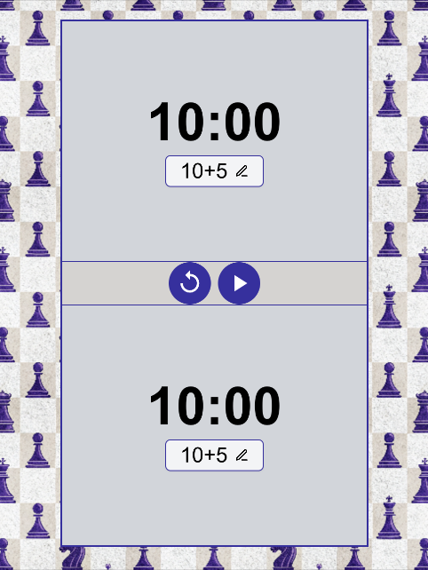

# Chess clock web application

A simple and customizable chess clock built with React. [Live Demo](https://chess-clock-delta.vercel.app/)




### Features

 - Classic chess timer with customizable time controls

 - Pause and reset functionality

 - Opportunity to add time to a player (for illegal moves)

 - Clean and responsive user interface

 - Keyboard shortcuts for quick control

 - Optimized for mobile devices


### Tech stack

 - React + Typescript + Redux

 - Tailwind CSS

 - Shadcn/ui components

 - Vite

 - Vercel

### Installation

```
git clone https://github.com/yanann11/chess-clock.git
cd chess-clock
npm install
npm install-components
npm run dev
```
