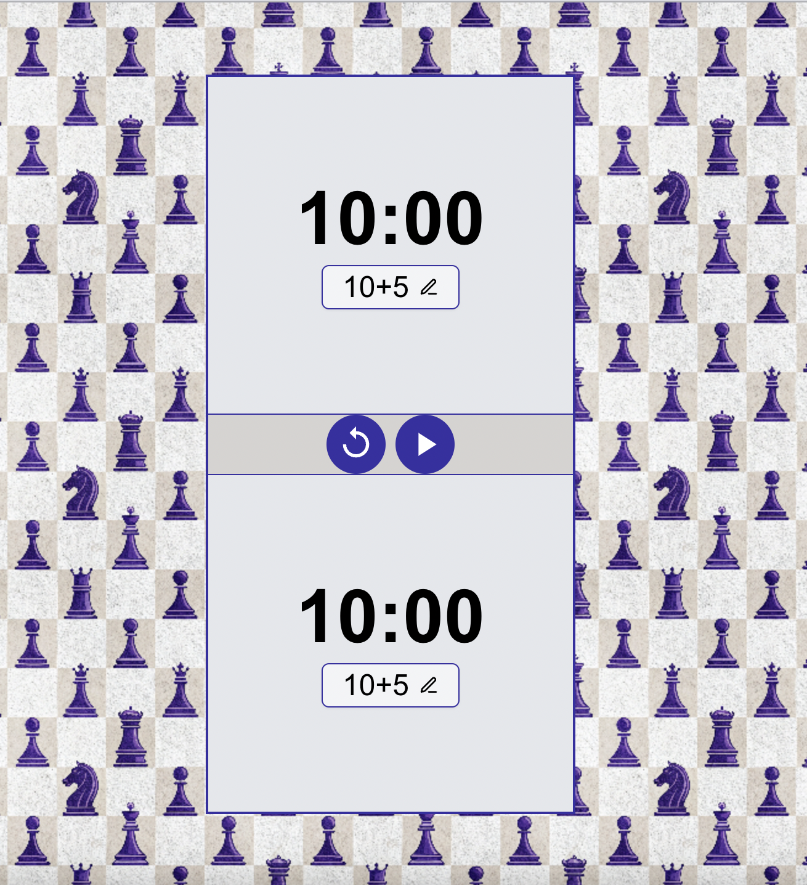

# Chess clock web application

A simple and customizable chess clock built with React.



[Live Demo](https://your-demo-link.com)

### Features

 - Classic chess timer with customizable time control
 - Simple and responsive UI
 - Keyboard control 
 - Mobile-friendly
 - Pause & Reset options


### Tech stack

 - React + Typescript + Redux
 - Tailwind
 - Shadcn/ui components
 - Vite
 - (Deploy)

### Installation

```
git clone https://github.com/yanann11/chess-clock.git
cd chess-clock
npm install
npm install-components
npm run dev
```
